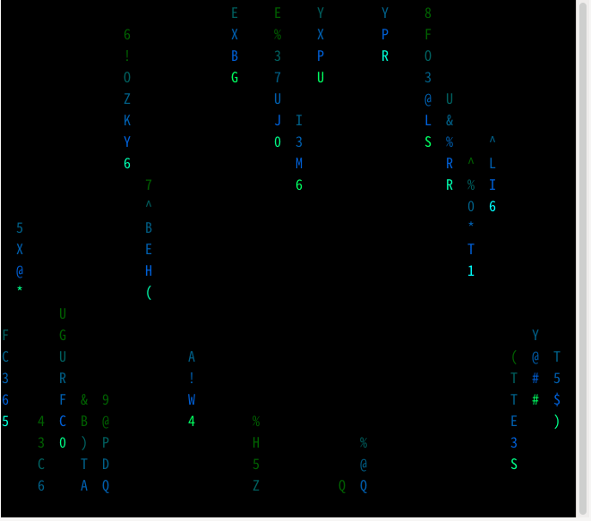

远程安装

```bash
raco pkg install https://github.com/lu96-wow/racket-tui.git
```



输入设计
所有按键抽象为统一事件 (read-event)，返回 (type data modifiers)：
```racket

(let-values ([(type data mods) (read-event)])
  (cond [(event-up? type)    (cursor-up 1)]
        [(event-ctrl? type)  (printf "Ctrl+~a" (ctrl->char data))]
        [(event-utf8? type)  (printf "UTF-8: ~a" (event->string data))]
        [(event-resize? type) (printf "~a×~a" (get-resize-rows data) (get-resize-cols data))]))
```
支持事件：key ctrl alt utf8 up down left right del insert home end pageup pagedown seq mod-seq resize null
自动解析 CSI 序列参数、UTF-8 多字节、修饰键组合，内置阻塞/非阻塞模式。
色彩输出
样式 = 颜色 + 属性，位置无关的自由组合：

```racket
(style-define! 'fancy clr-yellow bclr-blue attr-bold attr-underline)
(put-styled 'fancy "组合样式")
;; 真彩色快捷输出（不影响光标位置）
(put-rgb-fg-at 5 10 255 128 0 "橙色文字")
```
支持 ANSI 16 色 / 256 色 / 真彩色。put-at 自动保存恢复光标，对交互透明。
窗口 Resize
后台线程每 100ms 通过 ioctl(TIOCGWINSZ) 查询窗口大小，变化时注入 read-event 为 'resize 事件：
```racket

(with-tui
  (let loop ()
    (let-values ([(type data mods) (read-event)])
      (when (event-resize? type)
        (let-values ([(rows cols) (get-resize-size data)])
          (screen-clear)
          (redraw-ui rows cols)))
      (loop))))
```
无信号依赖，channel-try-get 零阻塞，窗口主动查询驱动。
光标追踪
所有光标操作自动追踪当前位置，put-at 输出后恢复原位，对交互式输入透明。
快速开始
```racket

#lang racket

(require tui)
(with-tui
  (screen-clear) (cursor-hide)
  (put-at 5 10 "Hello TUI!")
  (sleep 2))
```

racket-tui/tui	with-tui 生命周期
racket-tui/input	事件输入
racket-tui/output	光标/屏幕控制
racket-tui/output-color	颜色/样式
racket-tui/resize	窗口大小

ffi绑定只存在于base.rkt和resize.rkt,最小依赖